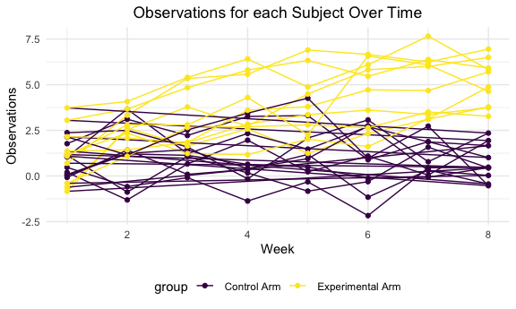

p8105\_hw5\_jf3354
================
Judy Fordjuoh
November 12, 2021

\#Loading all the librarys/setting the themes,color schemes, and the
graph output sizes

    ## ── Attaching packages ─────────────────────────────────────── tidyverse 1.3.1 ──

    ## ✓ ggplot2 3.3.5     ✓ purrr   0.3.4
    ## ✓ tibble  3.1.5     ✓ dplyr   1.0.7
    ## ✓ tidyr   1.1.3     ✓ stringr 1.4.0
    ## ✓ readr   2.0.1     ✓ forcats 0.5.1

    ## ── Conflicts ────────────────────────────────────────── tidyverse_conflicts() ──
    ## x dplyr::filter() masks stats::filter()
    ## x dplyr::lag()    masks stats::lag()

## Question 1:

Describe the raw data. Create a city\_state variable (e.g. “Baltimore,
MD”) and then summarize within cities to obtain the total number of
homicides and the number of unsolved homicides (those for which the
disposition is “Closed without arrest” or “Open/No arrest”

``` r
homicide_df = 
    read_csv("homicide-data.csv") %>% 
    mutate(
      city_state = str_c(city, state, sep = "_"),
      resolved = case_when(
        disposition == "Closed without arrest" ~ "unsolved",
        disposition == "Open/No arrest" ~ "unsolved",
        disposition == "Closed by arrest" ~ "solved"
        )
    ) %>% select(city_state,resolved) %>% 
  filter(city_state != "Tulsa_AL")
```

    ## Rows: 52179 Columns: 12

    ## ── Column specification ────────────────────────────────────────────────────────
    ## Delimiter: ","
    ## chr (9): uid, victim_last, victim_first, victim_race, victim_age, victim_sex...
    ## dbl (3): reported_date, lat, lon

    ## 
    ## ℹ Use `spec()` to retrieve the full column specification for this data.
    ## ℹ Specify the column types or set `show_col_types = FALSE` to quiet this message.

``` r
#finding the total number of homicides
total_hom = 
  homicide_df %>% 
  group_by(city_state) %>% 
  summarize(
    homicide_total = n(),
    homicide_unsolved = sum(resolved == "unsolved")
  )

total_hom
```

    ## # A tibble: 50 × 3
    ##    city_state     homicide_total homicide_unsolved
    ##    <chr>                   <int>             <int>
    ##  1 Albuquerque_NM            378               146
    ##  2 Atlanta_GA                973               373
    ##  3 Baltimore_MD             2827              1825
    ##  4 Baton Rouge_LA            424               196
    ##  5 Birmingham_AL             800               347
    ##  6 Boston_MA                 614               310
    ##  7 Buffalo_NY                521               319
    ##  8 Charlotte_NC              687               206
    ##  9 Chicago_IL               5535              4073
    ## 10 Cincinnati_OH             694               309
    ## # … with 40 more rows

\#The raw data set contains 52,129 homicides (the rows) across 50 large
cities in the U.S. collected by the Washington Post. There are 12
columns overall with variables that include uid, reported\_date,
victim\_last, victim\_first, victim\_race, victim\_age, victim\_sex,
city, state, lat, lon, and disposition. After cleaning up the data and
making the city\_state variable, there was only 2 variables and 52,128
observations. The data fram total\_hom contains the total number of
homicides and the total number of unsolved homicides in each city\_state

## Question 2

\#Create a tidy dataframe containing data from all participants,
including the subject ID, arm, and observations over time. 1) Start with
a dataframe containing all file names; 2) Iterate over file names and
read in data for each subject using purrr::map and saving the result as
a new variable in the dataframe, 3) Tidy the result; manipulate file
names to include control arm and subject ID, make sure weekly
observations are “tidy”, and do any other tidying that’s necessary

``` r
#Loading the data from the hw5_data file/creating a list by merging the spreadsheet
hw5data = 
  tibble(
    path = list.files("hw5_data")) %>% 
  mutate(
    path = str_c("hw5_data/", path), 
    data = map(path, read_csv) 
     ) %>% 
  unnest(data) %>%
  mutate(
    path = str_replace(path, "hw5_data/", " "), #
    path = str_replace(path, ".csv", " ")
    ) %>%
  separate(path, into = c("group","Subject_ID"),sep = "_")
```

    ## Rows: 1 Columns: 8

    ## ── Column specification ────────────────────────────────────────────────────────
    ## Delimiter: ","
    ## dbl (8): week_1, week_2, week_3, week_4, week_5, week_6, week_7, week_8

    ## 
    ## ℹ Use `spec()` to retrieve the full column specification for this data.
    ## ℹ Specify the column types or set `show_col_types = FALSE` to quiet this message.

    ## Rows: 1 Columns: 8

    ## ── Column specification ────────────────────────────────────────────────────────
    ## Delimiter: ","
    ## dbl (8): week_1, week_2, week_3, week_4, week_5, week_6, week_7, week_8

    ## 
    ## ℹ Use `spec()` to retrieve the full column specification for this data.
    ## ℹ Specify the column types or set `show_col_types = FALSE` to quiet this message.

    ## Rows: 1 Columns: 8

    ## ── Column specification ────────────────────────────────────────────────────────
    ## Delimiter: ","
    ## dbl (8): week_1, week_2, week_3, week_4, week_5, week_6, week_7, week_8

    ## 
    ## ℹ Use `spec()` to retrieve the full column specification for this data.
    ## ℹ Specify the column types or set `show_col_types = FALSE` to quiet this message.

    ## Rows: 1 Columns: 8

    ## ── Column specification ────────────────────────────────────────────────────────
    ## Delimiter: ","
    ## dbl (8): week_1, week_2, week_3, week_4, week_5, week_6, week_7, week_8

    ## 
    ## ℹ Use `spec()` to retrieve the full column specification for this data.
    ## ℹ Specify the column types or set `show_col_types = FALSE` to quiet this message.

    ## Rows: 1 Columns: 8

    ## ── Column specification ────────────────────────────────────────────────────────
    ## Delimiter: ","
    ## dbl (8): week_1, week_2, week_3, week_4, week_5, week_6, week_7, week_8

    ## 
    ## ℹ Use `spec()` to retrieve the full column specification for this data.
    ## ℹ Specify the column types or set `show_col_types = FALSE` to quiet this message.

    ## Rows: 1 Columns: 8

    ## ── Column specification ────────────────────────────────────────────────────────
    ## Delimiter: ","
    ## dbl (8): week_1, week_2, week_3, week_4, week_5, week_6, week_7, week_8

    ## 
    ## ℹ Use `spec()` to retrieve the full column specification for this data.
    ## ℹ Specify the column types or set `show_col_types = FALSE` to quiet this message.

    ## Rows: 1 Columns: 8

    ## ── Column specification ────────────────────────────────────────────────────────
    ## Delimiter: ","
    ## dbl (8): week_1, week_2, week_3, week_4, week_5, week_6, week_7, week_8

    ## 
    ## ℹ Use `spec()` to retrieve the full column specification for this data.
    ## ℹ Specify the column types or set `show_col_types = FALSE` to quiet this message.

    ## Rows: 1 Columns: 8

    ## ── Column specification ────────────────────────────────────────────────────────
    ## Delimiter: ","
    ## dbl (8): week_1, week_2, week_3, week_4, week_5, week_6, week_7, week_8

    ## 
    ## ℹ Use `spec()` to retrieve the full column specification for this data.
    ## ℹ Specify the column types or set `show_col_types = FALSE` to quiet this message.

    ## Rows: 1 Columns: 8

    ## ── Column specification ────────────────────────────────────────────────────────
    ## Delimiter: ","
    ## dbl (8): week_1, week_2, week_3, week_4, week_5, week_6, week_7, week_8

    ## 
    ## ℹ Use `spec()` to retrieve the full column specification for this data.
    ## ℹ Specify the column types or set `show_col_types = FALSE` to quiet this message.

    ## Rows: 1 Columns: 8

    ## ── Column specification ────────────────────────────────────────────────────────
    ## Delimiter: ","
    ## dbl (8): week_1, week_2, week_3, week_4, week_5, week_6, week_7, week_8

    ## 
    ## ℹ Use `spec()` to retrieve the full column specification for this data.
    ## ℹ Specify the column types or set `show_col_types = FALSE` to quiet this message.

    ## Rows: 1 Columns: 8

    ## ── Column specification ────────────────────────────────────────────────────────
    ## Delimiter: ","
    ## dbl (8): week_1, week_2, week_3, week_4, week_5, week_6, week_7, week_8

    ## 
    ## ℹ Use `spec()` to retrieve the full column specification for this data.
    ## ℹ Specify the column types or set `show_col_types = FALSE` to quiet this message.

    ## Rows: 1 Columns: 8

    ## ── Column specification ────────────────────────────────────────────────────────
    ## Delimiter: ","
    ## dbl (8): week_1, week_2, week_3, week_4, week_5, week_6, week_7, week_8

    ## 
    ## ℹ Use `spec()` to retrieve the full column specification for this data.
    ## ℹ Specify the column types or set `show_col_types = FALSE` to quiet this message.

    ## Rows: 1 Columns: 8

    ## ── Column specification ────────────────────────────────────────────────────────
    ## Delimiter: ","
    ## dbl (8): week_1, week_2, week_3, week_4, week_5, week_6, week_7, week_8

    ## 
    ## ℹ Use `spec()` to retrieve the full column specification for this data.
    ## ℹ Specify the column types or set `show_col_types = FALSE` to quiet this message.

    ## Rows: 1 Columns: 8

    ## ── Column specification ────────────────────────────────────────────────────────
    ## Delimiter: ","
    ## dbl (8): week_1, week_2, week_3, week_4, week_5, week_6, week_7, week_8

    ## 
    ## ℹ Use `spec()` to retrieve the full column specification for this data.
    ## ℹ Specify the column types or set `show_col_types = FALSE` to quiet this message.

    ## Rows: 1 Columns: 8

    ## ── Column specification ────────────────────────────────────────────────────────
    ## Delimiter: ","
    ## dbl (8): week_1, week_2, week_3, week_4, week_5, week_6, week_7, week_8

    ## 
    ## ℹ Use `spec()` to retrieve the full column specification for this data.
    ## ℹ Specify the column types or set `show_col_types = FALSE` to quiet this message.

    ## Rows: 1 Columns: 8

    ## ── Column specification ────────────────────────────────────────────────────────
    ## Delimiter: ","
    ## dbl (8): week_1, week_2, week_3, week_4, week_5, week_6, week_7, week_8

    ## 
    ## ℹ Use `spec()` to retrieve the full column specification for this data.
    ## ℹ Specify the column types or set `show_col_types = FALSE` to quiet this message.

    ## Rows: 1 Columns: 8

    ## ── Column specification ────────────────────────────────────────────────────────
    ## Delimiter: ","
    ## dbl (8): week_1, week_2, week_3, week_4, week_5, week_6, week_7, week_8

    ## 
    ## ℹ Use `spec()` to retrieve the full column specification for this data.
    ## ℹ Specify the column types or set `show_col_types = FALSE` to quiet this message.

    ## Rows: 1 Columns: 8

    ## ── Column specification ────────────────────────────────────────────────────────
    ## Delimiter: ","
    ## dbl (8): week_1, week_2, week_3, week_4, week_5, week_6, week_7, week_8

    ## 
    ## ℹ Use `spec()` to retrieve the full column specification for this data.
    ## ℹ Specify the column types or set `show_col_types = FALSE` to quiet this message.

    ## Rows: 1 Columns: 8

    ## ── Column specification ────────────────────────────────────────────────────────
    ## Delimiter: ","
    ## dbl (8): week_1, week_2, week_3, week_4, week_5, week_6, week_7, week_8

    ## 
    ## ℹ Use `spec()` to retrieve the full column specification for this data.
    ## ℹ Specify the column types or set `show_col_types = FALSE` to quiet this message.

    ## Rows: 1 Columns: 8

    ## ── Column specification ────────────────────────────────────────────────────────
    ## Delimiter: ","
    ## dbl (8): week_1, week_2, week_3, week_4, week_5, week_6, week_7, week_8

    ## 
    ## ℹ Use `spec()` to retrieve the full column specification for this data.
    ## ℹ Specify the column types or set `show_col_types = FALSE` to quiet this message.

``` r
#str_c() combines multiple character vectors into a single character vector
#A map function is one that applies the same action/function to every element of an object
#str_replace function replaces some characters with some other characters in a string

#We have to separate the observations and the weeks into their own columns
hw5data_ =
  hw5data %>% 
  pivot_longer(
    week_1:week_8,
    names_to = "Week", 
    names_prefix = "week_", 
    values_to = "Observations"
  ) %>%
  mutate(
    group = str_replace(group, "exp", "Experimental Arm"),
    group = str_replace(group, "con", "Control Arm"),
  ) %>%
  relocate(Subject_ID)

#Make a spaghetti plot showing observations on each subject over time
hw5data_ %>% 
  mutate(Week = as.numeric(Week)) %>%
  ggplot(aes(x = Week, y = Observations, color = group)) +
  geom_path(aes(group = Subject_ID)) +
  geom_point() +
  theme(plot.title = element_text(hjust = 0.5)) +
  labs(
      title = "Observations for each Subject Over Time",
      x = "Week",
      y = "Observations"
      )
```


\# ANSWER: Generally, we see that the experimental arm has a
higher/increasing trend in comparison to the control arm. As for the
control arm, the observations seem to be stable throughout the study’s
weeks. \#

## Question 3

\#The code chunk below loads the iris dataset from the tidyverse package
and introduces some missing values in each column. The purpose of this
problem is to fill in those missing values. \#For numeric variables, you
should fill in missing values with the mean of non-missing values. For
character variables, you should fill in missing values with “virginica”
\#Write a function that takes a vector as an argument; replaces missing
values using the rules defined above; and returns the resulting vector.
Apply this function to the columns of iris\_with\_missing using a map
statement.

``` r
#Loading the iris dataset so I can look at it
set.seed(10)

iris_with_missing = iris %>% 
  map_df(~replace(.x, sample(1:150, 20), NA)) %>%
  mutate(Species = as.character(Species))

#writing a function that replaces the NA's
jf_iris = function(x) {
   if (is.numeric(x)) { 
   replace_na(x, mean(x, na.rm = TRUE))
   }
   else if (is.character(x)) 
     {replace_na(x, "virginica")}
}

iris_completed = map(iris_with_missing, jf_iris)

#double checking to see if there are any NA's
is.na(iris_completed)
```

    ## Sepal.Length  Sepal.Width Petal.Length  Petal.Width      Species 
    ##        FALSE        FALSE        FALSE        FALSE        FALSE
